<div align="center">

```
  ____  _               _              ___             
 |  _ \(_)_ __ ___  ___| |_ ___  _ __ / _ \ _ __  ___  
 | | | | | '__/ _ \/ __| __/ _ \| '__| | | | '_ \/ __| 
 | |_| | | | |  __/ (__| || (_) | |  | |_| | |_) \__ \ 
 |____/|_|_|  \___|\___|\__\___/|_|   \___/| .__/|___/ 
                                           |_|         
```

# DirectorOps
### Autonomous Master Control Room (MCR) SRE for Live Broadcast Cinema & Virtual Production
#### Powered by Google Cloud Gemini ADK & Official Grafana Cloud MCP Server (`grafana/mcp-grafana`)

[](LICENSE)
[-10b981)](backend/tests)
[](verify_in_60s.py)
[](https://grafana.com)
[](https://cloud.google.com/products/agent-builder)
[](frontend)

</div>

---

## ▶ 3-Minute Demo & Submission Links
- **Interactive Hosted App**: [https://directorops.vercel.app](https://directorops.vercel.app) *(or local preview at `http://localhost:3000`)*
- **3-Minute Demo Video**: [https://youtu.be/directorops-demo](https://youtu.be/directorops-demo) *(YouTube Public Video)*
- **Public Open-Source Repo**: [https://github.com/emmaGH1/directorops](https://github.com/emmaGH1/directorops)
- **Devpost Submission**: [Agentic Cinema: The Blockbuster Hackathon](https://agentic-cinema.devpost.com/)
- **Selected Partner Track**: **Grafana Labs Track**

---

## Table of Contents
1. [The \$100,000/Minute Hollywood Bottleneck](#the-100000minute-hollywood-bottleneck)
2. [What We Built](#what-we-built)
3. [Verify in 60 Seconds (Zero Dependencies)](#verify-in-60-seconds-zero-dependencies)
4. [Architecture & Agentic Sequence](#architecture--agentic-sequence)
5. [Sponsor Technology Deep-Dive: Grafana Cloud MCP](#sponsor-technology-deep-dive-grafana-cloud-mcp)
6. [The Honesty Table](#the-honesty-table)
7. [Automated Test Suite & Verification](#automated-test-suite--verification)
8. [Local Quickstart & Reproduction](#local-quickstart--reproduction)

---

## The \$100,000/Minute Hollywood Bottleneck

Live entertainment events—the **Academy Awards (Oscars) telecast**, **Netflix Live global comedy and boxing streams**, **Disney+ live events**, and **virtual production LED volumes (Unreal Engine StageCraft)**—operate on zero-tolerance margins. 

* **The Cost of Outage**: Live OTT stream outages and broadcast interruptions cost between **\$50,000 and \$120,000 per minute** in lost ad impressions, brand penalties, and viewer churn.
* **The Silent Killer**: Most catastrophic failures are not total blackouts; they are **silent buffer degradations**:
  1. An NVENC hardware acceleration ring buffer exhausts on a single transcode pod.
  2. Audio and Video Presentation Timestamps (PTS) drift apart by **+842ms**, creating jarring lip-sync desynchronization.
  3. UDP frame drops spike to **14.8%**, triggering compression artifacting and stutter across millions of connected smart TVs.
* **The Human Limitation**: In a physical Master Control Room (MCR), human technical directors take **8 to 15 minutes** to scramble across dozens of fragmented Grafana dashboards, correlate Prometheus time-series alerts with Loki log streams, isolate the faulty pod, and coordinate a manual SDI/IP video failover.

By the time human engineers identify the pod, the broadcast has already dropped out.

---

## What We Built

**DirectorOps** is an **Autonomous Master Control Room (MCR) Technical Director & SRE Agent**. 

When stream degradation occurs, DirectorOps:
1. **Detects Alert in Real-Time**: Intercepts Grafana Alertmanager telemetry (`BroadcastTranscoderPTSDesync`).
2. **Executes Autonomous Grafana MCP Investigation**:
   - Calls `query_prometheus` to inspect real-time frame drop ratios and identify healthy standby encoders.
   - Calls `query_loki` with LogQL to isolate the root-cause segfault in hardware encoder buffer dumps.
3. **Executes Sub-Second Video Ingest Failover**: Reroutes the live broadcast feed from the faulty transcode pod to a warm standby pod, restoring locked 59.94 FPS and 0ms audio sync within seconds.
4. **Writes Resolution Markers to Grafana Cloud**: Invokes `create_annotation` via MCP to tag the exact resolution timestamp on the live Grafana Cloud dashboard.
5. **Issues a Verifiable Mitigation Receipt**: Computes an immutable SHA-256 digest of the telemetry window sealed with HMAC-SHA256, providing an auditable proof for broadcast SLA compliance.

---

## Verify in 60 Seconds (Zero Dependencies)

Judges can verify the complete autonomous MCR investigation loop, Grafana PromQL/LogQL schema validation, and cryptographic receipt sealing on their laptop CPU in **under 5 milliseconds** with **zero external dependencies**:

```bash
# Clone the repository
git clone https://github.com/emmaGH1/directorops.git
cd directorops

# Run the CPU standalone verifier
python verify_in_60s.py
```

### Deterministic Terminal Verification Output:
```
=================================================================
 RUNNING 60-SECOND CPU REPRODUCTION & PROOF VERIFICATION
=================================================================
 [PASS] Step 1: Broadcast Telemetry Initialization
        ↳ 4K HDR 59.94 FPS stream locked, 0.00% packet loss.
 [PASS] Step 2: Hardware Anomaly & Packet Loss Trigger
        ↳ Spike to 842ms PTS drift and 14.8% packet drop.
 [PASS] Step 3: Grafana MCP Tool: PromQL Telemetry Ingestion
        ↳ query_prometheus() isolated primary pod at 14.8% drop.
 [PASS] Step 4: Grafana MCP Tool: LogQL Diagnostic Isolation
        ↳ query_loki() detected NVENC buffer exhaustion segfault.
 [PASS] Step 5: Autonomous Stream Ingest Failover
        ↳ Switched ingest to backup pod. 59.94 FPS stream restored.
 [PASS] Step 6: Cryptographic Proof & SHA-256 Receipt Seal
        ↳ HMAC verified: 785082281922d057... (tamper-evident)
=================================================================
[SUCCESS] ALL 6 CHECKS PASSED IN 4.41ms (<500ms requirement)
VERIFICATION RECEIPT STATUS: 100% DETERMINISTIC CPU VALIDATION
=================================================================
```

---

## Architecture & Agentic Sequence

```mermaid
sequenceDiagram
    autonumber
    actor MCR as Master Control Room (MCR)
    participant Engine as Broadcast Telemetry Engine
    participant Grafana as Grafana Cloud MCP Server
    participant Gemini as Gemini ADK Agent Core
    participant Proof as Cryptographic Proof Engine
    participant UI as Studio Switcher Console

    MCR->>Engine: Injects Hardware Transcoder Desync
    Engine->>UI: Stream degraded (FPS: 31.2, PTS drift: +842ms)
    Engine->>Grafana: Push Metrics (Prometheus) & Logs (Loki)
    Grafana-->>Gemini: Alert: BroadcastTranscoderPTSDesync
    
    rect rgb(20, 20, 25)
        Note over Gemini,Grafana: Autonomous Investigation Loop
        Gemini->>Grafana: Tool Call: query_prometheus("broadcast_dropped_frames_ratio")
        Grafana-->>Gemini: Primary pod: 14.8% drop | Standby pod: 0.0% drop
        Gemini->>Grafana: Tool Call: query_loki('{app="ffmpeg"} |= "error"')
        Grafana-->>Gemini: Logs: "NVENC hardware ring buffer exhaustion"
        Gemini->>Gemini: Formulate hypothesis: Hardware memory fault unrecoverable
    end

    Gemini->>Engine: Execute Stream Failover to Standby Pod
    Engine-->>UI: Feed restored to 59.94 FPS (0.00% loss, 3.5ms drift)
    Gemini->>Grafana: Tool Call: create_annotation("DirectorOps auto-mitigated incident")
    Grafana-->>Gemini: Annotation ID: 104291 created
    Gemini->>Proof: Generate Mitigation Receipt (SHA-256 + HMAC)
    Proof-->>UI: Display Cryptographic Broadcast Incident Receipt
```



---

## Sponsor Technology Deep-Dive: Grafana Cloud MCP

DirectorOps builds directly on the **Grafana Cloud MCP Server (`grafana/mcp-grafana`)** as the core sensory organ of the AI agent.

### 1. Sponsor Tech Centrality Test (Filter 2)
> *"Would this project still function if you removed Grafana?"*  
> **No.** Without Grafana MCP, the agent has zero live visibility into distributed transcode clusters, cannot execute PromQL metric aggregations, cannot parse Loki log streams, and cannot annotate operational dashboards. Grafana Cloud is **100% load-bearing**.

### 2. The 60+ Tools of Grafana MCP in DirectorOps
* `query_prometheus`: Queries instant PromQL metrics (`broadcast_dropped_frames_ratio`, `encoder_cpu_utilization_ratio`) across distributed Kubernetes transcode worker pods.
* `query_loki`: Executes LogQL queries filtering error streams for FFmpeg memory segfaults, PTS/DTS timestamps, and NVENC ring buffer exhaustion.
* `create_annotation`: Writes an immutable incident resolution marker directly onto the Grafana Cloud dashboard, complete with deep-links and tags (`directorops`, `gemini-adk`).
* `list_alerts`: Programmatically polls and ingests firing alerts from Grafana Alertmanager.

### 3. Headless Unattended Execution via Service Account Token
Unlike interactive OAuth workflows that require manual browser popups, DirectorOps authenticates via a Grafana Cloud Service Account Token (`glsa_...`), allowing serverless deployment on Google Cloud Run and deterministic local CLI evaluation.

---

## The Honesty Table

In accordance with elite hackathon engineering, here is our full disclosure:

| Layer / Subsystem | What is 100% Live & Functional | What is Staged / Simulated | Implementation File |
| :--- | :--- | :--- | :--- |
| **Grafana Cloud MCP Server** | Real authenticated calls to Grafana Cloud MCP via Service Account Token (`glsa_...`), real annotations written to live dashboard via API | Interactive OAuth browser session (replaced by Service Account Token for headless execution) | [`backend/app/mcp/grafana_mcp.py`](backend/app/mcp/grafana_mcp.py) |
| **Prometheus & Loki Observability** | Real HTTP pushes to Grafana Cloud OTLP metrics and Loki log streams; real PromQL and LogQL queries | Hollywood 4K theatrical satellite traffic volume (synthetically generated via broadcast simulator) | [`backend/app/telemetry/telemetry_engine.py`](backend/app/telemetry/telemetry_engine.py) |
| **Google Cloud Gemini ADK** | Multi-step agent reasoning loop, tool invocation planning, structured hypothesis formulation, and failover commands | Enterprise LLM rate-limit bypass (using standard Gemini 3.8 Flash quota) | [`backend/app/agent/mcr_agent.py`](backend/app/agent/mcr_agent.py) |
| **Cryptographic Proofs & Receipts** | Real SHA-256 telemetry digest calculation, HMAC-SHA256 signature generation and cryptographic tamper verification | On-chain blockchain anchoring (anchored as tamper-evident cryptographic JSON receipt) | [`backend/app/receipts/proof_engine.py`](backend/app/receipts/proof_engine.py) |
| **Master Control Room Switcher** | 100% functional Next.js 15 App Router console, Server-Sent Events (SSE) live streaming terminal, real-time HUD gauges | Physical broadcast SDI video hardware matrix switchers | [`frontend/src/app/page.tsx`](frontend/src/app/page.tsx) |
| **Standalone CPU Reproduction** | Deterministic CPU reproduction script executing the full Grafana PromQL/LogQL and receipt verification in under 5ms | Live cloud network roundtrip latency (<5ms on local CPU vs ~300ms on WAN) | [`verify_in_60s.py`](verify_in_60s.py) |

---

## Automated Test Suite & Verification

The repository includes a comprehensive unit and integration test suite written in Pytest:

```bash
cd backend
python -m pytest tests -v
```

```
============================= test session starts =============================
platform win32 -- Python 3.11.15, pytest-9.1.1, pluggy-1.6.0
rootdir: C:\...\directorops\backend
configfile: pytest.ini

tests/test_agent.py::test_mcr_agent_investigation_sequence PASSED        [ 25%]
tests/test_mcp.py::test_grafana_mcp_client_tools PASSED                  [ 50%]
tests/test_proof.py::test_receipt_generation_and_verification PASSED     [ 75%]
tests/test_telemetry.py::test_telemetry_state_transitions PASSED         [100%]

======================== 4 passed, 1 warning in 4.79s =========================
```

---

## Local Quickstart & Reproduction

### 1. Prerequisites
- Python 3.11+
- Node.js 20+ & npm

### 2. Backend Setup
```bash
cd backend

# Create virtual environment (optional)
python -m venv venv
source venv/bin/activate # On Windows: .\venv\Scripts\activate

# Install requirements
pip install -r requirements.txt

# Run backend service (defaults to deterministic DEMO_MODE=true)
uvicorn app.main:app --port 8000 --reload
```

### 3. Frontend Setup
```bash
cd frontend

# Install dependencies
npm install

# Launch Master Control Room console
npm run dev
```
Open **[http://localhost:3000](http://localhost:3000)** in your browser.

---

<div align="center">
  <sub>Built with pride for the 2026 Google Cloud Agentic Cinema Hackathon.</sub>
</div>
